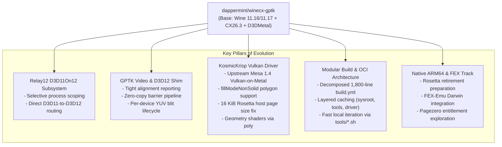

# Architectural Evolution & Changes Since Forking from Dappermint

## 1. Executive Summary & Fork Heritage

`winecx-gptk` was originally forked from [dappermint/winecx-gptk](https://github.com/dappermint/winecx-gptk) to provide a Game Porting Toolkit (GPTK / D3DMetal) compatible Wine runtime for the [Whisky](https://github.com/Whisky-App/Whisky) ecosystem. 

While the original upstream focused on stabilizing CodeWeavers CrossOver 26.3 patches rebased onto Wine 11.16/11.17 for x86_64 under Rosetta 2, this fork has evolved into an advanced, multi-track runtime system. It introduces major architectural enhancements across Direct3D translation, Vulkan drivers, video decoding, native ARM64 execution, and modular CI/build infrastructure.

---

## 2. Runtime Core & Versioning Evolution

The runtime stream has advanced from the initial series 4.5 baseline through **canary 4.7.51**, continuously published to the runtime catalog with updated platform capabilities:

* **Dynamic Catalog Stamping ([runtime-catalog.json](file:///Users/niltonperimneto/winecx-gptk/runtime-catalog.json))**:
  - Expanded capability descriptors including `gptkMajorVersions: [3, 4]`.
  - Network and async IPC capabilities: `wsarecvmsg`, `ipv4ReceiveTOS`, `ipv6ReceiveTrafficClass`, `overlappedReceiveMessage`.
  - Process isolation: `childLaunchPolicies` (schema 1) and `gameModeProcessHost`.
  - Active graphics classifiers: `d3d11`, `dxgi`, `d3d12`, `d3d12core`, `vulkan`, `dxvk`, `dxmt`, `wined3d`, `wow64`.

---

## 3. Relay12 D3D11On12 Subsystem

In stock D3DMetal environments, Direct3D 11 relies entirely on DXVK or DXMT translating to Metal/Vulkan. Apple's native D3D11On12 implementation was missing or stubbed.

* **Relay12 Integration**: Integrated `niltonperimneto/relay12` (pinned at `6373fdd`) to forward `D3D11On12CreateDevice` to Relay12's native modules.
* **Process-Specific Scoping**:
  - Uncontrolled D3D11On12 interposition breaks Steam WebHelper (Chromium) and launcher overlays.
  - Implemented selective routing controlled by environment variables:
    - `RELAY12_EXPERIMENTAL_FRAME=1`: Master activation switch.
    - `RELAY12_EXPERIMENTAL_FRAME_APPS`: Whitelist of game binaries.
    - `RELAY12_EXPERIMENTAL_FRAME_SKIP`: Explicit blacklist for launchers (e.g. `steamwebhelper.exe`).
* **Verification Fixtures**: Added [tests/d3d11_on12stub_mock.c](file:///Users/niltonperimneto/winecx-gptk/tests/d3d11_on12stub_mock.c) and [tests/d3d11on12core_mock.c](file:///Users/niltonperimneto/winecx-gptk/tests/d3d11on12core_mock.c) validating that interposition routes accurately across whitelisted, foreign, and launcher processes.

---

## 4. GPTK Video Interposer & D3D12 Shim Robustness

Games utilizing D3D12 video decoding (Media Foundation / Direct3D 12 video processors) previously suffered from pipeline stalls, memory leaks, and texture corruption during in-game cutscenes:

* **Tight Alignment Reporting**: Fixed D3D12 resource allocation alignment reporting in [gptk-video/d3d12shim.c](file:///Users/niltonperimneto/winecx-gptk/gptk-video/d3d12shim.c), preventing Apple D3DMetal crashes on strict resource boundaries.
* **Zero-Copy Barrier Optimization**: Restored the high-performance zero-copy barrier pass-through path once video playback finishes. Barrier arrays exceeding 32 elements are now preserved and forwarded intact without unnecessary heap reallocations.
* **Per-Device YUV Blit Lifecycle**: Refactored [gptk-video/yuvblit.h](file:///Users/niltonperimneto/winecx-gptk/gptk-video/yuvblit.h) so pipeline state objects (PSOs) and color conversion resources are tracked per `ID3D12Device`, preventing cross-device resource leaks when video playback devices are destroyed and recreated.
* **Recording Test Interposer**: Created [tests/d3d12shim.c](file:///Users/niltonperimneto/winecx-gptk/tests/d3d12shim.c) and [tests/d3d12shim_mock.c](file:///Users/niltonperimneto/winecx-gptk/tests/d3d12shim_mock.c) to inspect and verify every command forwarded to D3DMetal in headless CI.

---

## 5. KosmicKrisp (Mesa Vulkan-on-Metal) Implementation Track

While MoltenVK provides stable baseline Vulkan support, it lacks modern Vulkan 1.3/1.4 core features required by stock upstream DXVK (2.x / 3.x). This fork introduced an experimental KosmicKrisp track based on Mesa:

* **Driver & Loader Packaging**:
  - Implemented [runtime/kosmickrisp/build.sh](file:///Users/niltonperimneto/winecx-gptk/runtime/kosmickrisp/build.sh) cross-compiling an `x86_64` slice of Mesa (`libvulkan_kosmickrisp.dylib`), the Khronos Vulkan Loader (`libvulkan.1.dylib`), and relocatable ICD manifests.
  - Dedicated launchers ([wine-kosmickrisp](file:///Users/niltonperimneto/winecx-gptk/runtime/kosmickrisp/wine-kosmickrisp), [wine-kosmickrisp-dxvk](file:///Users/niltonperimneto/winecx-gptk/runtime/kosmickrisp/wine-kosmickrisp-dxvk)) utilizing `WINE_VULKAN_LIBRARY` and `VK_DRIVER_FILES`.
* **Rosetta 4 KiB vs. 16 KiB Memory Budget Fix**:
  - Discovered that `host_statistics64` returned page counts in the host kernel's 16 KiB units, but x86_64 processes under Rosetta calculate `PAGE_SIZE` as 4 KiB.
  - Mesa reported only 25% of available system VRAM to `VK_EXT_memory_budget`.
  - Developed and carried [runtime/kosmickrisp/patches/0002-util-use-the-host-page-size-for-available-memory-on-.patch](file:///Users/niltonperimneto/winecx-gptk/runtime/kosmickrisp/patches/0002-util-use-the-host-page-size-for-available-memory-on-.patch) using `host_page_size()`.
* **fillModeNonSolid Polygon Mode Support**:
  - DXVK 3.1.1 refused adapter creation without `fillModeNonSolid`.
  - Implemented [0001-kk-expose-fillModeNonSolid-through-Metal-s-triangle-.patch](file:///Users/niltonperimneto/winecx-gptk/runtime/kosmickrisp/patches/0001-kk-expose-fillModeNonSolid-through-Metal-s-triangle-.patch) and upstream port [44786-geometry-fillmode.patch](file:///Users/niltonperimneto/winecx-gptk/runtime/kosmickrisp/patches/44786-geometry-fillmode.patch), mapping `VkPolygonMode` to Metal's `setTriangleFillMode:`. Enabled stock DXVK 3.1.1 to initialize D3D9 and D3D11 (FL 11_1) devices.
* **Geometry Shaders via Poly**:
  - Integrated Mesa MR 44786 lowering geometry shaders to compute passes in NIR.
* **Hardware & Synthetic Validation**:
  - Deterministic compute readback probe ([tests/kosmickrisp_probe.c](file:///Users/niltonperimneto/winecx-gptk/tests/kosmickrisp_probe.c), [tests/kosmickrisp_compute.comp](file:///Users/niltonperimneto/winecx-gptk/tests/kosmickrisp_compute.comp)).
  - Win32 swapchain window resizing, borderless fullscreen, and display recovery.
  - Physical Metal detection probe ([tests/kosmickrisp_metal_probe.m](file:///Users/niltonperimneto/winecx-gptk/tests/kosmickrisp_metal_probe.m)) preventing crashes on headless/virtual CI runners.

---

## 6. Build System Overhaul & OCI Layer Architecture

The original `.github/workflows/build.yml` was a monolithic script that rebuilt all dependencies from scratch on every run (45–90+ minutes). The overhauled architecture decomposes the system into modular lifecycle tiers:

* **Modular Shell Scripts ([tools/](file:///Users/niltonperimneto/winecx-gptk/tools/))**:
  - Extracted inline CI scripts into standalone tools:
    - [tools/setup_sysroot.sh](file:///Users/niltonperimneto/winecx-gptk/tools/setup_sysroot.sh): Prepares pinned Nixpkgs x86_64 host libraries.
    - [tools/setup_mingw.sh](file:///Users/niltonperimneto/winecx-gptk/tools/setup_mingw.sh): Pinned `llvm-mingw` UCRT cross-compiler.
    - [tools/build_wine_tools.sh](file:///Users/niltonperimneto/winecx-gptk/tools/build_wine_tools.sh): Builds native `__tooldeps__` (`wmc`, `wrc`, `widl`).
    - [tools/configure_wine.sh](file:///Users/niltonperimneto/winecx-gptk/tools/configure_wine.sh) & [tools/make_wine.sh](file:///Users/niltonperimneto/winecx-gptk/tools/make_wine.sh): Compiles Wine PE and Unix binaries.
    - [tools/assemble_runtime.sh](file:///Users/niltonperimneto/winecx-gptk/tools/assemble_runtime.sh) & [tools/package_runtime.sh](file:///Users/niltonperimneto/winecx-gptk/tools/package_runtime.sh): Ingests payloads, rewrites `@loader_path`, and codesigns.
    - [tools/run_probes.sh](file:///Users/niltonperimneto/winecx-gptk/tools/run_probes.sh): Unified execution of relocatability, windowing, and D3D/Vulkan feature probes.
* **OCI Layer Caching ([tools/build/oci.sh](file:///Users/niltonperimneto/winecx-gptk/tools/build/oci.sh))**:
  - Implemented OCI container/registry layer caching for `sysroot`, `tools`, `payloads`, and `driver`.
  - Re-uses immutable binary archives when pins do not change, dropping active development build cycles down to **3–5 minutes**.
* **Specialized CI Workflows**:
  - [.github/workflows/kosmickrisp.yml](file:///Users/niltonperimneto/winecx-gptk/.github/workflows/kosmickrisp.yml): Dedicated Mesa/driver build pipeline.
  - [.github/workflows/validate.yml](file:///Users/niltonperimneto/winecx-gptk/.github/workflows/validate.yml): Reusable verification matrix.
  - [.github/workflows/oci-ci-test.yml](file:///Users/niltonperimneto/winecx-gptk/.github/workflows/oci-ci-test.yml): Fast Linux contract tests for build scripts.

---

## 7. Native ARM64 Host & FEX Exploration Lane

Anticipating Apple's eventual retirement of Rosetta 2 in future macOS versions, an exploratory native ARM64 lane was established in [arm64/](file:///Users/niltonperimneto/winecx-gptk/arm64/):

* **Native ARM64 Wine Compilation**: Recipes in [arm64/build-arm64-unix.sh](file:///Users/niltonperimneto/winecx-gptk/arm64/build-arm64-unix.sh) to build Wine's Unix half natively for `arm64-apple-darwin`.
* **FEX-Emu Integration**:
  - Scripts ([arm64/build-fex-arm64.sh](file:///Users/niltonperimneto/winecx-gptk/arm64/build-fex-arm64.sh), [arm64/install-fex.sh](file:///Users/niltonperimneto/winecx-gptk/arm64/install-fex.sh)) compiling FEX with macOS patches ([arm64/fex/patches/](file:///Users/niltonperimneto/winecx-gptk/arm64/fex/patches/)).
  - Smoke tests ([tests/fex_unixlib_smoke.c](file:///Users/niltonperimneto/winecx-gptk/tests/fex_unixlib_smoke.c), [tests/x86_smoke.c](file:///Users/niltonperimneto/winecx-gptk/tests/x86_smoke.c)).
* **Pagezero & Address Space Research**:
  - Developed [tests/pagezero_probe.c](file:///Users/niltonperimneto/winecx-gptk/tests/pagezero_probe.c) to document the architectural requirement for the `com.apple.developer.cross-architecture-support` entitlement to map the low 4GB of virtual address space on Apple Silicon.
* **Wine.app Bundle Packaging**: [arm64/make-wine-app.sh](file:///Users/niltonperimneto/winecx-gptk/arm64/make-wine-app.sh) for bundling and signing under developer provisioning profiles.

---

## 8. Comprehensive Feature Comparison Table

| Capability / Subsystem | Upstream (Dappermint Baseline) | Current Fork (`niltonperimneto/winecx-gptk`) |
| :--- | :--- | :--- |
| **Wine / CrossOver Base** | Wine 11.0 / CrossOver 26.3 | Wine 11.16/11.17 + CrossOver 26.3, Canary 4.7.51 |
| **D3D11On12 Support** | Missing / Stubs only | Integrated Relay12 with process-selective routing |
| **D3D12 Video Playback** | Basic interposer | Tight alignment, zero-copy barriers, per-device YUV PSOs |
| **Vulkan Implementations** | MoltenVK 1.4.2 only | Dual stack: MoltenVK baseline + KosmicKrisp experimental |
| **Upstream DXVK Compatibility** | Frozen at DXVK 1.10.x | DXVK 3.1.1 supported via KosmicKrisp `fillModeNonSolid` |
| **Rosetta Memory Budget** | 4 KiB host bug (75% VRAM loss) | Patched with `host_page_size()` 16 KiB reporting |
| **Build Architecture** | Monolithic 1,800-line `build.yml` | Tiered OCI-layer caching + modular `tools/*.sh` |
| **Clean Build Turnaround** | 50–90+ minutes | 3–5 minutes (cached layers) / ~15 minutes (clean) |
| **ARM64 / FEX Exploration** | None | Fully scripted ARM64 build, FEX integration, and probes |
| **Automated Testing** | Smoke tests only | 75+ unit & contract tests, DDI concurrency fixtures, probes |

---

## 9. Consolidated Documentation Directory Map

* **Architecture & Build System**:
  - [docs/build-system-plan.md](file:///Users/niltonperimneto/winecx-gptk/docs/build-system-plan.md): 4-cycle build overhaul specification.
  - [docs/oci-build-system.md](file:///Users/niltonperimneto/winecx-gptk/docs/oci-build-system.md): OCI container layer caching guide.
  - [docs/oci-ci-results.md](file:///Users/niltonperimneto/winecx-gptk/docs/oci-ci-results.md): CI execution benchmarks and layer measurements.
* **KosmicKrisp & Vulkan**:
  - [docs/kosmickrisp-plan.md](file:///Users/niltonperimneto/winecx-gptk/docs/kosmickrisp-plan.md): Long-term migration gates and feasibility roadmap.
  - [docs/kosmickrisp-experimental.md](file:///Users/niltonperimneto/winecx-gptk/docs/kosmickrisp-experimental.md): Architecture of the experimental Vulkan runtime.
  - [docs/kosmickrisp-performance.md](file:///Users/niltonperimneto/winecx-gptk/docs/kosmickrisp-performance.md): Rosetta performance analysis and memory budget fix.
  - [docs/kosmickrisp-test-results.md](file:///Users/niltonperimneto/winecx-gptk/docs/kosmickrisp-test-results.md): Measured test results and Hades benchmark logs.
  - [docs/kosmickrisp.md](file:///Users/niltonperimneto/winecx-gptk/docs/kosmickrisp.md): Rosetta fallback deployment guide.
  - [docs/kosmickrisp-dxvk-local.md](file:///Users/niltonperimneto/winecx-gptk/docs/kosmickrisp-dxvk-local.md) & [docs/kosmickrisp-fillmode-port.md](file:///Users/niltonperimneto/winecx-gptk/docs/kosmickrisp-fillmode-port.md): Technical notes on DXVK 3.x and polygon mode porting.
* **Direct3D & Relay12**:
  - [docs/DDI-CONCURRENCY-TESTING.md](file:///Users/niltonperimneto/winecx-gptk/docs/DDI-CONCURRENCY-TESTING.md): Concurrency contracts and memory padding tests for DDI.
* **Native ARM64 & FEX**:
  - [arm64/README.md](file:///Users/niltonperimneto/winecx-gptk/arm64/README.md): Native ARM64 Wine and FEX execution manual.
