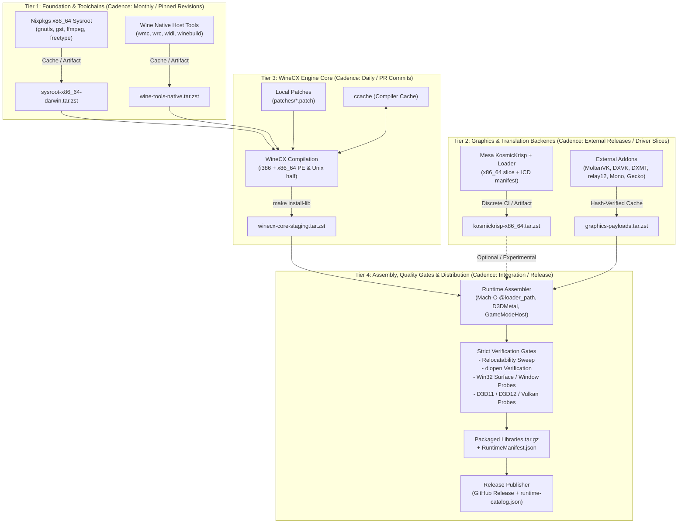

# Build System Overhaul Plan: Decoupling Development & Distribution Cycles

## 1. Executive Summary & Problem Diagnosis

The current build pipeline in [.github/workflows/build.yml](file:///Users/niltonperimneto/winecx-gptk/.github/workflows/build.yml) is a monolithic 1,600+ line workflow that rebuilds nearly the entire runtime from scratch on every push or manual dispatch. A typical run takes 45 to 90+ minutes (with a 300-minute timeout ceiling).

### Key Pain Points:
1. **Monolithic Coupling**: Host sysroot generation (Nixpkgs), native tool compilation (`__tooldeps__`), PE/Unix cross-compilation (`winecx`), experimental Mesa compilation (`KosmicKrisp`), payload downloads, Mach-O fixups, quality probes, and release publishing are locked inside a single GitHub Actions job (`build`).
2. **Duplication of Expensive Work**:
   - **Nix Sysroot**: Re-evaluates and downloads 15+ x86_64-darwin packages (`gnutls`, `gstreamer`, `ffmpeg-headless`, `freetype`) despite `NIXPKGS_REV` rarely changing.
   - **Wine Native Tools**: Reconfigures and compiles `wmc`, `wrc`, `widl`, `winebuild`, and `sfnt2fon` on every run.
   - **KosmicKrisp Driver**: Compiles LLVM, SPIRV-Tools, Mesa, and Khronos Vulkan-Loader for x86_64 (~20–30 min) even when only Wine patches or test probes are modified.
   - **External Addons**: Downloads MoltenVK, DXVK, DXMT, relay12, Mono, and Gecko on every workflow run.
3. **No Developer Fast Loop**: Developers testing a single Wine patch, a linker tweak, or a test probe in `tests/` cannot run an isolated build locally or in CI without triggering the full multi-stage cascade.
4. **Fragile Distribution**: If a release build fails on a late-stage validation probe (e.g. window creation or relocatability), the entire compile is discarded and must be rerun from scratch.

---

## 2. Target Architecture: The 4-Cycle Tiered Pipeline

The overhauled architecture separates dependencies and execution into four distinct lifecycle tiers based on their change frequency and role:



---

## 3. Detailed Cycle Breakdown

### Cycle A: Foundation & Toolchain (Static Layer)
* **Components**:
  - Pinned Nixpkgs closure (`NIXPKGS_REV`) providing x86_64 Darwin dependencies (`freetype`, `gnutls`, `gstreamer`, `ffmpeg-headless`, `libpng`, `zlib`).
  - Native host tools compiled from WineCX (`wmc`, `wrc`, `widl`, `winebuild`, `sfnt2fon`).
  - `llvm-mingw` UCRT cross-compiler toolchain.
* **Storage & Caching Strategy**:
  - Packaged as `sysroot-x86_64-darwin.tar.zst` and `wine-tools-native.tar.zst`.
  - Cached via GitHub Actions Cache with immutable keys: `sysroot-${NIXPKGS_REV}` and `tools-${WINECX_COMMIT}`.
  - Fallback: Stored as GitHub Release assets in a dedicated `toolchains` release tag for zero-computation cold boots.
* **Turnaround**: Evaluated in < 30 seconds when cache hits; only rebuilt when `NIXPKGS_REV` or `WINECX_COMMIT` changes.

### Cycle B: Graphics & Translation Backends (Decoupled Layer)
* **Components**:
  1. **KosmicKrisp Experimental Bundle**:
     - Extracted into a dedicated workflow: `.github/workflows/build-kosmickrisp.yml`.
     - Triggered only when `runtime/kosmickrisp/**` changes or on manual dispatch.
     - Produces `kosmickrisp-x86_64.tar.zst` containing `libvulkan.1.dylib`, `libvulkan_kosmickrisp.dylib`, `libz.1.dylib`, and `kosmickrisp_icd.json`.
  2. **External Payloads Cache**:
     - Pre-fetches and verifies MoltenVK, DXVK, DXMT, relay12, Mono, and Gecko based on SHA-256 signatures.
     - Stored as `graphics-payloads.tar.zst` keyed by workflow version constants.
* **Turnaround**: 0 seconds during normal Wine development; ~25 minutes only when driver pins or patches change.

### Cycle C: WineCX Core Compilation (Developer Fast Loop)
* **Components**:
  - Clones `niltonperimneto/winecx` at `WINECX_COMMIT`.
  - Applies local patches (`patches/*.patch`).
  - Consumes prebuilt native `wine-tools` and prebuilt Nix `sysroot`.
  - Configures and runs `make -j$(sysctl -n hw.ncpu) install-lib DESTDIR=staging`.
  - Emits `winecx-core-staging.tar.zst`.
* **Optimization Levers**:
  - Skips rebuilding host tools and Nix packages.
  - Leverages warmed `ccache` (configured with `CCACHE_BASEDIR`, `CCACHE_NOHASHDIR=1`, and `CCACHE_FILECLONE=1`).
* **Turnaround**:
  - **Cold compile (no ccache)**: ~12–15 minutes (down from 50+ min).
  - **Warm compile (ccache hit / patch edit)**: **3 to 5 minutes**.

### Cycle D: Assembly, Validation Gates & Distribution
* **Components**:
  1. **Assembly Script (`tools/assemble_runtime.sh`)**:
     - Unpacks `winecx-core-staging.tar.zst` and `graphics-payloads.tar.zst`.
     - Compiles and injects `GameModeProcessHost`.
     - Executes `install_name_tool` and ad-hoc codesigning.
  2. **Validation Matrix (`.github/workflows/validate.yml`)**:
     - **Relocatability Gate**: Sweeps Mach-O headers for absolute paths.
     - **dlopen Gate**: Runs `dlopenall.c` against masked paths.
     - **Windowing & Media Gate**: Ensures Wine can spawn windows and decode video.
     - **Graphics Probes**: Runs `vkfeat.c`, `dx12feat.c`, `qaiprobe.c`, and `wsarecvmsg.c`.
  3. **Release & Catalog Publication**:
     - If triggered on a release tag or manual release dispatch:
       - Archives final `Libraries.tar.gz`.
       - Calculates SHA-256 and updates `runtime-catalog.json`.
       - Creates GitHub Release with changelog.

---

## 4. Local vs. CI Workflow Parity

Currently, large bash scripts are embedded directly inside `.github/workflows/build.yml`. To enable local testing and modular execution, extract inline scripts into dedicated tools in `tools/`:

| Script Path | Purpose | CI Job Equivalent |
| :--- | :--- | :--- |
| `tools/setup_sysroot.sh` | Fetch or restore Nixpkgs x86_64 sysroot | `nix toolchain and x86_64 libs` |
| `tools/build_wine_tools.sh` | Build native `wine-tools` (`__tooldeps__`) | `native tools build` |
| `tools/build_wine_core.sh` | Configure & compile Wine PE + Unix | `configure` & `make` |
| `tools/fetch_payloads.sh` | Download & verify MoltenVK, DXMT, DXVK, etc. | Payload download steps |
| `tools/assemble_runtime.sh` | Assemble into `Libraries/Wine` & rewrite rpaths | `install and package` |
| `tools/run_probes.sh` | Execute smoke probes & relocatability tests | Relocatability & validation steps |

---

## 5. Implementation Roadmap & Migration Steps

### Phase 1: Script Modularization (Non-Breaking)
1. Extract inline bash logic from `build.yml` into standalone scripts in `tools/` with strict `set -euo pipefail`.
2. Ensure each script can run both locally on an Apple Silicon machine and in GitHub Actions runners.

### Phase 2: Layered Caching & Sysroot Prebuilding
1. Implement `tools/setup_sysroot.sh` with GitHub Actions Cache / artifact fallback (`sysroot-${NIXPKGS_REV}`).
2. Implement caching for `wine-tools` native build (`tools-${WINECX_COMMIT}`).

### Phase 3: Decouple KosmicKrisp into a Separate Workflow
1. Move KosmicKrisp compilation into `.github/workflows/kosmickrisp.yml`.
2. Upload prebuilt `kosmickrisp-x86_64.tar.zst` as an Actions artifact / release asset.
3. Update main runtime build to ingest the prebuilt bundle instead of rebuilding Mesa inline.

### Phase 4: Workflow Restructuring (GitHub Actions Matrix/Jobs)
Split `build.yml` into a pipeline of dependent jobs:
```
[cache-check / restore]
       ↓
 [build-wine-core]
       ↓
[assemble-runtime]
       ↓
[validate-gates]
       ↓
    [publish]
```

### Phase 5: Fast Developer Iteration Mode
1. Provide a local `./tools/dev-build.sh --fast` that skips sysroot/payload downloads and rebuilds only modified Wine modules with ccache.
2. Enable dispatch input `rebuild_all: false` in CI to use cached intermediate artifacts whenever pins have not changed.
