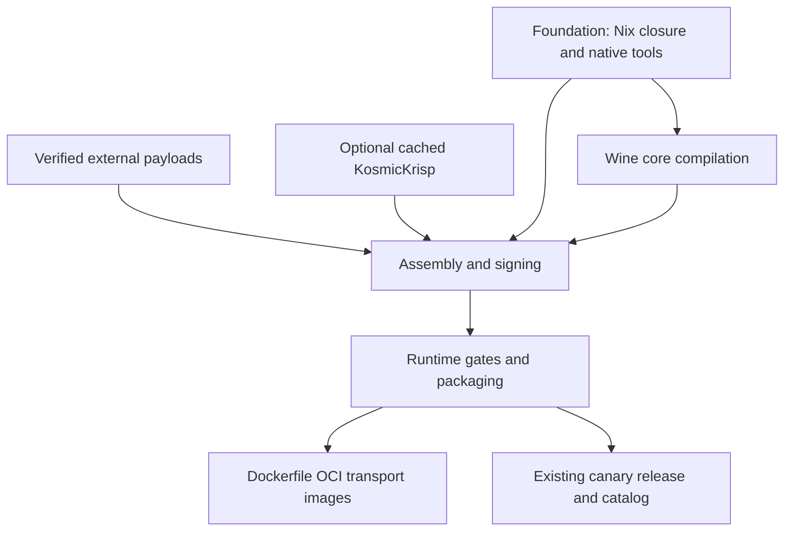

# OCI build system

The pipeline stores build layers in GHCR. Darwin compilation and validation run
on `macos-26`; Linux BuildKit builds the Docker transport images. The current
Wine build uses Xcode frameworks, native Wine tools, Darwin Nix libraries,
`install_name_tool`, signing, and real macOS window/media probes. Running these
steps in a Linux Docker container would require a separate cross-compilation
port and would still require macOS validation.

## Pipeline



The main workflow uses these independent jobs:

- `foundation`: restore or build the sysroot/toolchain and native Wine tools.
- `payloads`: restore or fetch hash-verified Mono, Gecko, MoltenVK, DXVK, DXMT,
  and Relay12. Wine source is checked out to resolve addon versions.
- `graphics`: call the dedicated KosmicKrisp workflow only when enabled; a
  disabled invocation succeeds without building a driver.
- `core`: restore foundation and tools, compile with ccache, and run
  `install-lib` into `staging`.
- `assemble`: restore core, payloads, and sysroot, assemble `Libraries`, rewrite
  Mach-O references, sign, and stamp the runtime version.
- `build`: restore assembled output and run relocatability, deployment floor,
  symbol availability, window, media, dlopen, receive-message, and D3D12
  interposer gates; then emit the existing runtime archive and manifest.
- `oci-images`: use Docker Buildx on Linux to publish transport images of the
  foundation, tools, payloads, core, and verified runtime.

The reusable `validate.yml` workflow is used by the main pipeline and can also
be dispatched against saved artifacts. KosmicKrisp requires a Metal 4 device,
not just a non-null Metal device. Set the repository variable
`MACOS_GPU_RUNNER` to a suitable macOS 26 runner label for experimental
assembly and GPU validation; compilation remains on the hosted builder. The
OCI driver integration test reports unsupported hardware as blocked and skips
its device test, while experimental assembly still requires the strict probe.

The existing experimental packaged-runtime/readiness gates and canary publishing
rules remain in place. Experimental and fast builds do not publish releases.
Apple's D3DMetal payload continues to be supplied by the application's GPTK
importer; this build preserves its existing packaging arrangement.

## Registry contracts

ORAS manifests live at `ghcr.io/<owner>/<repository>/<component>:<key>`.
Components are `sysroot`, `tools`, `payloads`, `kosmickrisp`, `core`, `assembled`,
and `runtime`. Each package contains:

- `layer.tar.zst`: the component's files, with relative workspace paths.
- `metadata.json`: schema, component, source commit, and archive SHA-256.

Every consumer pulls `@sha256:<manifest digest>`. ORAS verifies the OCI blobs;
the importer also checks the component/envelope checksum and validates archive
paths before extraction. Missing cache manifests trigger a rebuild;
authentication, network, and integrity errors fail the job.

Reusable cache keys include relevant scripts, patches, pinned revisions, native
architecture, Xcode SDK version, and compiler identity. The sysroot package
exports the **complete Nix closure**, including native tool dependencies, using
`nix-store --export`; consumers import it to the same `/nix/store` paths before
using `.pc` metadata or dynamic libraries. `build-tools/nls/locale.nls` is copied
into the tools package so it survives relocation. Compiler objects continue to
use Actions ccache, independently of the registry layers.

Core, assembled, and final runtime tags include commit, run ID, and attempt.
They are retained before subsequent quality gates run, so GitHub's **re-run
failed jobs** can retry assembly or validation without rebuilding successful
upstream jobs. Successful Foundation and payload cache tags are reused until
their inputs change. `rebuild_all` bypasses their lookup; it does not clear
ccache. Measured turnaround depends on registry transfer time, closure size,
and ccache hits; no compile-time guarantee is made by this migration.

`tools/build/pins.env` is the common source for dependency pins. `RUNTIME_SERIES`
stays in `build.yml` for the existing history-based version counter.

## CI setup

The workflow authenticates to GHCR with `github.token` and grants
`packages: write` to producer jobs. Packages created previously must grant this
repository Actions access. Keep `WINECX_DEPLOY_KEY` for the private Wine checkout.
No registry secret is needed for GHCR in the same repository. This change only
adds files; it does not create remote packages or change their visibility until
the workflows run. The workflow currently triggers on pushes and dispatches,
not on untrusted fork pull requests.

Dispatch `build.yml` with the existing `opt`, `kosmickrisp`, and `runtime_version`
inputs. Set `rebuild_all: true` to rebuild cache layers. KosmicKrisp can also be
prebuilt through `kosmickrisp.yml`; changes under `runtime/kosmickrisp/` trigger
that workflow directly. Driver construction checks relocation and dynamic
linkage without requiring a GPU; real device enumeration remains a strict
experimental assembly/validation gate. To test new probes against an existing assembly,
dispatch `validate.yml` with its saved sysroot and assembled digest references.
Standalone validation uploads a verified artifact and never publishes a release.

For manual Linux inspection, use [ORAS push/pull](https://oras.land/docs/how_to_guides/pushing_and_pulling/).

## Local macOS development

Install Xcode command-line tools and Nix with `extra-platforms = x86_64-darwin`.
Use the same SDK as the CI producer when compiling cached layers. Bootstrap
installs missing Homebrew `oras`, `zstd`, and `ccache` and verifies Rosetta.

```bash
./tools/bootstrap_build.sh
oras login ghcr.io

# Copy the exact references from the foundation job's outputs or ORAS logs.
./tools/build/oci.sh pull sysroot ghcr.io/OWNER/REPO/sysroot@sha256:DIGEST
./tools/build/oci.sh pull tools ghcr.io/OWNER/REPO/tools@sha256:DIGEST

# SSH authentication is needed if the Wine repository is private.
git clone git@github.com:niltonperimneto/winecx.git winecx
source tools/build/pins.env
git -C winecx checkout --detach "$WINECX_COMMIT"
./tools/prepare_source.sh
./tools/dev-build.sh --fast
./tools/dev-build.sh --fast --module dlls/ntdll/all
```

`--fast` builds with `-O0 -g0`, performs no downloads, and uses the existing
source/build directories. The first invocation configures; subsequent ones
reuse Make's dependency graph. Changing optimisation mode or supplying
`--configure` reruns configure. `--module` builds a specific Make target without
installing the whole runtime. Local state and logs live in `.build/`. Apply
patches once to a clean pinned Wine checkout; `prepare_source.sh` deliberately
fails if reapplied to an already patched tree.

For local assembly, restore `core` and `payloads` packages, then run
`tools/assemble_runtime.sh`, `tools/run_probes.sh`, and
`tools/package_runtime.sh`. Set `RUNTIME_VERSION_OVERRIDE` for an explicit
version, and `OPT_LEVEL=fast` for a fast build. Use a clean output workspace when
restoring or assembling a different artifact; the importer does not delete
unrelated existing files.

## Dockerfile architecture

`docker/Dockerfile` has independent scratch targets for each component. These
are artifact transport images containing the same archive and metadata under
`/winecx/<component>/`. They have no entrypoint and are not executable macOS
containers. Image tags use `COMMIT-RUN_ID-ATTEMPT` and repository names such as
`ghcr.io/OWNER/REPO/core-image`.

To build an image locally after pulling an ORAS package:

```bash
mkdir -p .build/images/core
oras pull ghcr.io/OWNER/REPO/core@sha256:DIGEST --output .build/images/core
docker buildx build -f docker/Dockerfile --target core \
  --tag ghcr.io/OWNER/REPO/core-image:local --push .build/images
```

`docker/compose.Dockerfile` composes independently built images into
`development` (sysroot + tools + core) or `assembly-inputs` (plus payloads):

```bash
docker buildx build -f docker/compose.Dockerfile --target assembly-inputs \
  --build-arg SYSROOT_IMAGE=ghcr.io/OWNER/REPO/sysroot-image@sha256:DIGEST \
  --build-arg TOOLS_IMAGE=ghcr.io/OWNER/REPO/tools-image@sha256:DIGEST \
  --build-arg CORE_IMAGE=ghcr.io/OWNER/REPO/core-image@sha256:DIGEST \
  --build-arg PAYLOADS_IMAGE=ghcr.io/OWNER/REPO/payloads-image@sha256:DIGEST \
  --output type=local,dest=.build/exported .
./tools/import_layer.sh sysroot .build/exported/winecx/sysroot
./tools/import_layer.sh tools .build/exported/winecx/tools
./tools/import_layer.sh core .build/exported/winecx/core
./tools/import_layer.sh payloads .build/exported/winecx/payloads
```

Composition accepts **Docker transport images**, not ORAS artifact manifests.
BuildKit's [local exporter](https://docs.docker.com/build/exporters/local-tar/)
exports the composed files for import on macOS. Docker packaging runs on a
Linux Docker/BuildKit host, including Docker Desktop's VM; the macOS machine
runs the Darwin build scripts after import.

## Verification

```bash
actionlint .github/workflows/*.yml
shellcheck -S warning -e SC1091 tools/*.sh tools/build/*.sh
python3 -m unittest discover -s tests -p 'test_*.py' -v
```

A full clean CI build is required to exercise Nix imports, private source
checkout, all macOS compilation/probes, GHCR transfers, and Docker publication.
